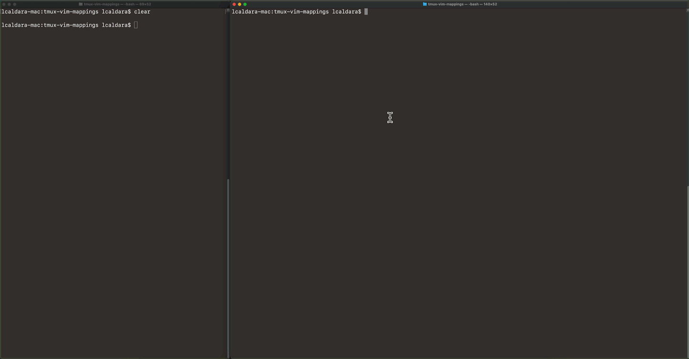

# tmux-vim-mappings

Most of the work is copied from Franck Pachot's [tmux-interactive-demo](https://github.com/FranckPachot/tmux-interactive-demo).

## Setup

Clone the repository and run the installer:

```bash
git clone https://github.com/ludovicocaldara/tmux-vim-mappings.git
cd tmux-vim-mappings
./install.sh
```

The installer backs up existing files with a timestamped `.save` suffix, then installs:

```text
~/.tmux.conf
~/.vimrc
~/.runFromVim.sh
~/.sendBuffer.sh
```

To install manually instead:

```bash
cp tmux.conf ~/.tmux.conf
cp vimrc ~/.vimrc
cp runFromVim.sh ~/.runFromVim.sh
cp sendBuffer.sh ~/.sendBuffer.sh
chmod 755 ~/.runFromVim.sh ~/.sendBuffer.sh
```

## Usage

* Start a tmux session (or attach an existing one):

    ```bash
    tmux new-session
    ```

* Open the demo script with `vi`:

    ```bash
    vi testme.bash
    ```

    

* Go through the demo by pressing `PgDown`:

    If you are on Mac and you don't have `PgDown` on your keyboard, you can edit `~/.vimrc` and remap to another keypress.

## Demo script syntax

* Plain lines are sent to the active tmux pane and executed with `Enter`.
* Blank lines send `Enter`.
* Lines starting with `---` are executed by the shell after the prefix is removed.
* Lines starting with `--- ##` are displayed in the tmux message bar.
* Lines starting with `tmux ` are executed as tmux commands for compatibility with older demos.

## Development

Run the syntax checks with:

```bash
make test
```

## Notes

* On Windows, it works like a charm with most clickers. Logitech pointers come with a software to customize the buttons.
* On MacOS, you might find [Karabiner-Elements](https://karabiner-elements.pqrs.org/) useful to remap device keys.
* Not tested with clickers on Linux. Let me know if that works for you! `tmux` via `ssh` and using cloud shells work perfectly.
